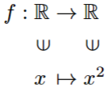

この記事は[hydrogen Advent Calender 2024](https://adventar.org/calendars/10672)の23日目の記事です。

## ブログで数式を書きたい

[この記事](../astro-building-blog/)で触れたKaTeXについてもう少し詳しく説明する。

現在、このブログにある記事24点の内9点が数学タグのついた記事になっており、想像以上にこのブログの記事が数学で埋め尽くされていることがうかがえる。

そして、この数学記事を書く上では数式を書くことが欠かせない。単純な数式ならば、`x+y=z`のように直書きすればいいが集合論の$\forall x\forall y(\forall z(z\in x\eqn z\in y)\Rightarrow x=y)$のような複雑な式を書く場合はこれでは非常に見づらくなってしまう。そのため、数式をきれいに表示するためにKaTeXを導入しTeXの記法で数式を書くことにした。

例えば、先の式は`$\forall x\forall y(\forall z(z\in x\Leftrightarrow z\in y)\Rightarrow x=y)$`と書くことができる。この他に$\defeqn$は`\overset{\mathrm{def}}{\Leftrightarrow}`と表せ、$\RR$は`\mathbb{R}`と表せる。

### マクロの定義

だが、定義の説明をするたびに`\overset{\mathrm{def}}{\Leftrightarrow}`などと書くのは極めて面倒である。普通にTeXを使う場合は`\def`や`\newcommand`を使って定義をしておけばいいが、KaTeXではこのようにしてマクロを定義することが出来ない。いや、厳密にいえば同じ数式ブロック内であれば利用可能だが、他の数式ブロックで利用することはできない。他の数式ブロックで使うには`\gdef`を使ってグローバルに定義する必要がある。

```latex
\gdef\defeqn{\overset{\mathrm{def}}{\Leftrightarrow}}
```

ここで、グローバルに定義するとは言ったがこれも各ページごとに分けられており、例えば$\RR$のような頻繁に利用するマクロを各ページで定義する必要がある。そのため、全てのページでマクロを追加するには`astro.config.mjs`に次のようにしてあらかじめマクロの対応を追加しておく必要がある。

```ts
...
export default defineConfig({
    ...
    markdown: {
        remarkPlugins: [remarkMath],
        rehypePlugins: [[rehypeKatex, {
            macros: {
                "\\RR": "\\mathbb{R}",
                "\\CC": "\\mathbb{C}",
                "\\ZZ": "\\mathbb{Z}",
                "\\NN": "\\mathbb{N}",
                "\\QQ": "\\mathbb{Q}",
                "\\cf": "\\mathrm{cf}",
                "\\dom": "\\mathrm{dom}",
                "\\cod": "\\mathrm{cod}",
                "\\id": "\\mathrm{id}",
                "\\Im": "\\mathrm{Im}",
                "\\Re": "\\mathrm{Re}",
                "\\Hom": "\\mathrm{Hom}",
                "\\Ker": "\\mathrm{Ker}",
                "\\eps": "\\epsilon",
                "\\defeqn": "\\overset{\\mathrm{def}}{\\Leftrightarrow}",
                "\\defequiv": "\\stackrel{\\mathrm{def}}{\\equiv}",
                "\\eqn": "\\Leftrightarrow",
            },
        }]],
    },
});
```

このようにして、各ページでマクロを定義することなく数式を書くことができる。

### KaTeXで出来ないこと

KaTeXはLaTeXのほぼサブセットであるため、LaTeXで出来ることが全て出来るわけではない。例えば、`\usepackage`でパッケージを追加することが出来ない。よく導入されるパッケージはすでにKaTeXに組み込まれているが、それ以外のパッケージを使いたい場合はKaTeXを使うことができない。

そして、写像の記法に必要な`\vin`もKaTeXには存在しない。これは$\in$を縦にしたもので、次のようにして使う。



そのため、[この記事](../cofinality/)では別の記法を使わざるを得なかった。
