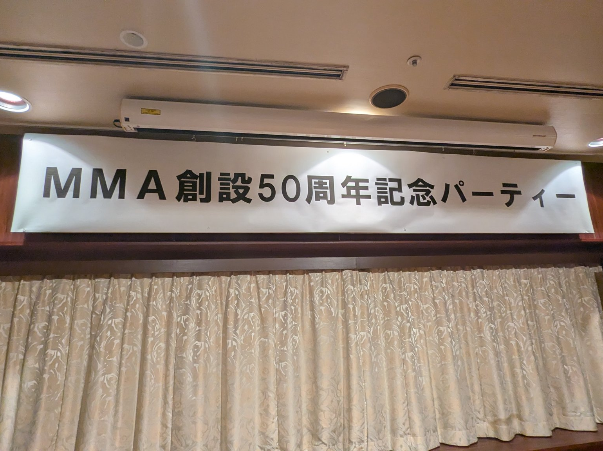
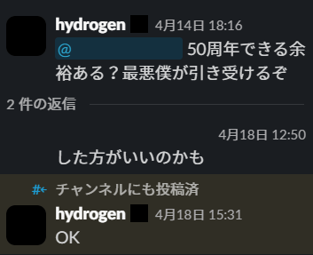

この記事は[UEC Advent Calender 2025](https://adventar.org/calendars/11571)の19日目の記事です。

前日の記事はトナカイさんの[ペーパードライバーに向けたカーシェア活用法](javascript::void())です。遅刻らしいです。私も大遅刻しました。

## はじめに

筆者が所属する電気通信大学MMAは今年で創立50周年を迎えました。これを記念して10月25日に創立50周年記念パーティーが開催され、多くのOB・OG、現役部員、歴代顧問の先生方が一堂に会しました。

当日のツイートなどは[#mma50th](https://x.com/hashtag/mma50th)にまとまっているかと思われますので、当日の様子に興味のある方は見てみてください。

また、MMAの歴史に興味のある方は簡単な概要が[公式サイト](https://mma.club.uec.ac.jp/History)にございますのでぜひご覧ください

この記事では、主幹事を務めた筆者がパーティーの裏話や、準備段階でのあれこれなどを軽く話していきたいと思います。

## 発端

実のところ記念パーティーの構想自体は去年の春ごろからありました。しかし、部会にて開催する決議自体は通ったものの、具体的な準備は我々が忙しかったこともありなかなか進みませんでした。

年は明けて2025年の春、ある程度僕の手が空いたこともあって多忙であった発案者から主幹事の立場を引き取って準備を本格的に始めることになりました。

## 呼びかけ

いくら自分の手が空いていたとしても、パーティーには50年前にサークルに所属されていた方々が来られるため、OBの協力が必要不可欠でした。また、パーティーをいつ開催するかについても決定する必要がありました。

そのため、事前調査と題し大まかな開催時期と運営への参加の可否を問い、その結果現役部員と合わせて9人に協力いただけました。パーティーの企画はここから本格的に始動し、運営メンバーと何度か会議を重ねて企画内容を詰めていきました。

## 会場探し

まず問題になったのが会場です。会場はほぼ確実に大学がある調布市になるため、調布駅周辺で会場候補になりうる場所を調べる必要がありました。上がった案は大まかに分けると大学構内で行うものと、大学以外の会場を借りるものでした。

大学以外の会場については[調布市文化会館 たづくり](https://www.chofu-culture-community.org/tazukuri)にある大会議場が十分な収容人数があり、なおかつ安いということもあり最有力でしたが、会場を抑えるのに失敗したためあえなく断念しました。

そこで登場したのが創立40周年記念パーティーで会場として使った[調布クレストンホテル](https://hmihotelgroup.com/crestonhotel-chofu/)の大宴会場でした。下見等で確認を行い、かなりの融通が利くことや会場の設営の大まかな部分をまるまる会場側に任せることができるといった点も有利に働き、最終的にはこちらを会場としてパーティーを実行しました。

大学構内で行う案については、収容人数の問題や会場の取り回しなどが課題となり最終的に採用しませんでした。

## 企画

次に問題になったのは企画です。当初の計画から、OBを語り部としてMMAの50年の歴史を振り返ろうというものはありました。ただ、せっかくの50周年ということもありもっと他に面白い企画を立てようとしていました。一応、色々な案は出たものの正直なところ全参加者の印象に残るようなパンチの効いたものが浮かばぬまま、時は流れて開催予定であった10月になってしまいました。

そんな中のことでした、運営の一人であったakitoshi君がNOCの話を持ち掛けてきたのは。

私は、「これだ」と思って会場側にアポを取り、提案者たるakitoshi君とともに会場に光回線を引くべく交渉しました。

その結果下のツイートのような状況につながるわけです。

<blockquote class="twitter-tweet tw-align-center">
MMAまじか！！<a href="https://twitter.com/hashtag/mma50th?src=hash&amp;ref_src=twsrc%5Etfw">#mma50th</a> <a href="https://t.co/gMKr4WWwOL">pic.twitter.com/gMKr4WWwOL</a>
&mdash; えぬぴー (@Np27182) <a href="https://twitter.com/Np27182/status/1982010866024530176?ref_src=twsrc%5Etfw">October 25, 2025</a></blockquote>

急遽動き出した企画でしたが無事に当日の荒波にも耐え、ある程度参加者の印象に残せたと思えましたので結果的にやって正解でした。

## 最後に

当日は会の進行などで手間取りながらの進行でしたが、無事に50周年記念パーティーを終えることが出来ました。MMA関係者の皆様には改めて御礼申し上げます。

<blockquote class="twitter-tweet tw-align-center">
MMA創立50周年記念パーティーの主幹事をさせていただきました。なんだかんだありつつも、無事に会を終えることが出来ました。MMAのOB/OGのみなさま、歴代顧問の皆様、現役部員の皆様並びに運営に協力していただいた方々には心から感謝申し上げます。 <a href="https://twitter.com/hashtag/mma50th?src=hash&amp;ref_src=twsrc%5Etfw">#mma50th</a>
&mdash; 水素 (@Hydrogen_D1) <a href="https://twitter.com/Hydrogen_D1/status/1982083259631869970?ref_src=twsrc%5Etfw">October 25, 2025</a></blockquote>

明日の記事は、電2（でんじ）さんによる「なにもかんがえてない」らしいです。彼も遅刻しているとのことです。
