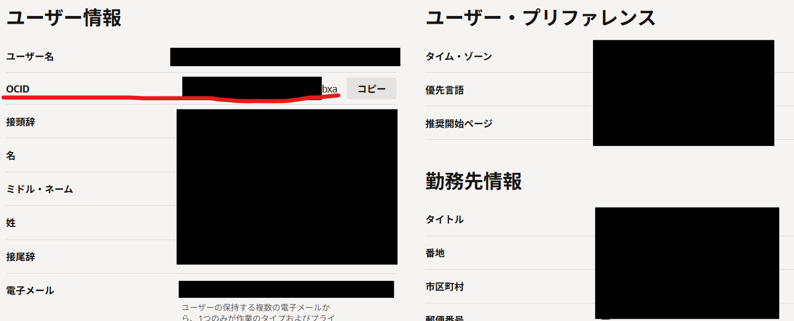
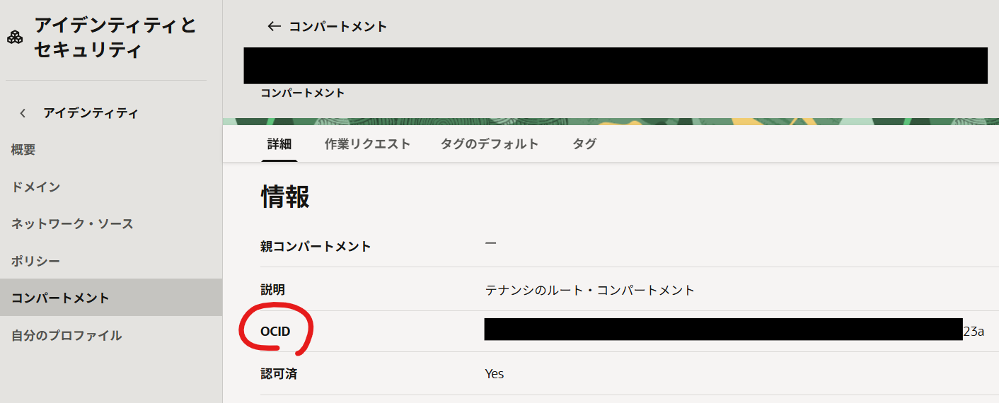
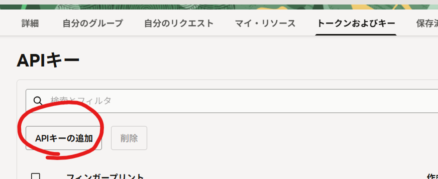
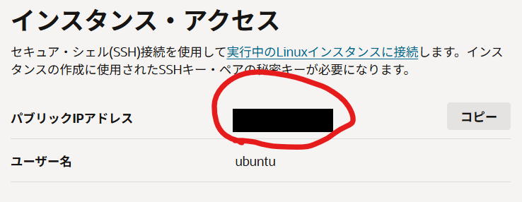
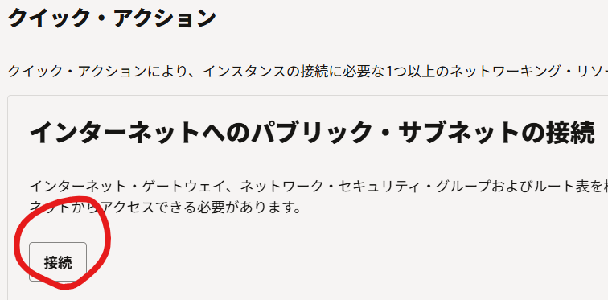
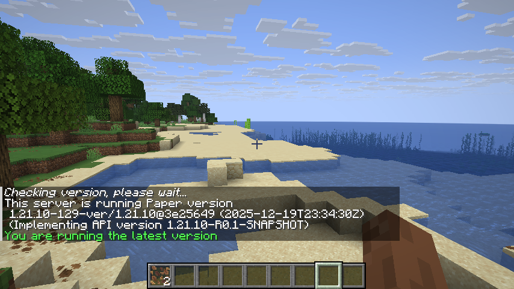

この記事は[whywaita Advent Calender 2025](https://adventar.org/calendars/11433)の19日目の記事です。大遅刻しました、申し訳ないです……

前日の記事はtwismikoさんの[時を超えてGenAIでおいでませ！！whywaita Chatbot！！（簡略版）](https://twismik0.hatenablog.com/entry/2025/12/23/233443)でした。近年の技術の進歩はすさまじいですね。1人に1つwhywaita chatbotの時代がいつの日か訪れることでしょう。ちなみに私もあおかなをやっています。時間が足りないので進みはあまりよろしくないですが。

最近、Oracle Cloud Infrastructure (OCI)の無料枠が充実しているという話を聞き、試しに使ってみることにしました。

## アカウント作成

アカウント作成についてですが、[Oracle Cloud Free Tier](https://www.oracle.com/jp/cloud/free/)のページから「無料で始める」ボタンを押して進めていきます。アカウント作成にはクレジットカード情報が必要ですが、無料枠の範囲内であれば料金は発生しません。また、途中に個人なのに部署名を聞かれるところがありますが、適当に「なし」などと入れれば問題ありません。

注意点としては、ホーム・リージョンは後から変更できないため、選択を間違えないようにしましょう。東京リージョンは当然のようにアクセスが集中しているため、Ampereインスタンスに制限がかかるらしいです。私は大阪リージョンを選択しました。

## VCNとサブネットの作成

OCIではインスタンスを作成する前に、VCN (Virtual Cloud Network)とサブネットを作成しておく必要があります。

ダッシュボードのバーガーメニューから「ネットワーキング」→「仮想クラウドネットワーク」を選択し、「VCNの作成」ボタンを押します。

名前は適当でいいのですが、CIDRブロックは`10.0.0.0/16`の範疇になるように指定します。(例:`10.0.0.0/24`)残りの項目はデフォルトのままで問題ありません。

VCNが作成できたら、次にサブネットを作成します。VCNの詳細画面に移動し、「サブネット」タブを選択して「サブネットの作成」ボタンを押します。

名前はここでも自由に指定できますが、CIDRブロックはVCNのCIDRブロックの範囲内で指定する必要があります。(例:`10.0.0.0/24`を指定した場合、サブネットは`10.0.0.0/24`よりも大きい範囲でできない)また、一番重要な点として、「サブネット・アクセス」が「パブリック」に設定されていることを確認してください。なんと、これでグローバルIPアドレスが無料で降ってきます(正直これが一番すごい)。

## CLIクライアントのインストール

OCIで一番無料枠が充実しているのはArm系のAmpereインスタンスです。そして、そのことはOCI利用者はみんな知っているので必然的にそこに人気が集中して、仮想マシンを確保するのが大変になります。

GUIからインスタンスを作成しようとすると作成失敗時に、また1から情報を入力しなければならなくなることがあるため、CLIによって情報入力を自動化して作成リクエストを送ることにしました。

インストールには~~親の顔と同じぐらい見たcurlワンライナー~~下のコマンドを使います。

```bash
bash -c "$(curl -L https://raw.githubusercontent.com/oracle/oci-cli/master/scripts/install/install.sh)"
```

しばらく待って、適当にyを入力していけばインストールは完了します。バイナリはデフォルトだと`~/bin`に配置されるので、パスが通ってなかったら通しましょう。

<!-- aaa -->

次に。OCI CLIを使うための設定を行います。以下のコマンドを実行します。

```bash
oci setup config
```

以下の情報を取得して入力します。

1. ユーザーOCID
2. テナントOCID
3. リージョン (例: ap-osaka-1)

ユーザーOCIDはユーザー設定内ではこの画像の赤線部に書かれています。



テナントOCIDは同じくユーザー設定内の「コンパートメント」項目内に書かれています。



リージョンは、OCIのダッシュボード上部に表示されている情報を参考にしてください。

あとは適当に進めれば設定は完了します。最後に、APIを叩けるように公開鍵を登録する必要があります。公開鍵は`~/.oci/oci_api_key_public.pem`に生成されているので、この内容をコピーしてOCIのユーザー設定内の「APIキー」項目から登録してください。



これでCLIクライアントの設定は完了です。

## インスタンスの作成

インスタンスを作成するうえでは、いくつか重要な情報を事前に取得しておく必要があります。

1. Availability Domain
2. シェイプID
3. イメージOCID
4. サブネットOCID

Availability Domainを取得するには、以下のコマンドを実行します。

```bash
oci iam availability-domain list
```

```json
{
  "data": [
    {
      "compartment-id": "---23a",
      "id": "---ika",
      "name": "XXXX:AP-OSAKA-1-AD-1"
    }
  ]
}
```

ここでは`XXXX:AP-OSAKA-1-AD-1`をメモしておきます。

シェイプIDはAmpereインスタンスの場合、`VM.Standard.A1.Flex`を指定します。一応調べ方も載せておきます。なお、(以降のコマンドもそうなのですが)なぜかconfigで指定したはずのテナントOCIDが必要になるので注意してください。

```bash
oci compute shape list --compartment-id <tenant_ocid> \
    --output table \
    --query 'data[].{"1_ShapeID":"shape", "2_Processor":"processor-description"}'
```

```
+------------------------+-----------------------------------------------+
| 1_ShapeID              | 2_Processor                                   |
+------------------------+-----------------------------------------------+
| BM.Standard.E6.256     | 2.7 GHz AMD EPYC™ 9J45 (Turin)                |
...
| VM.Standard.E3.Flex    | 2.25 GHz AMD EPYC™ 7742 (Rome)                |
| VM.Standard.A1.Flex    | 3.0 GHz Ampere® Altra™                        |
| VM.Standard2.1         | 2.0 GHz Intel® Xeon® Platinum 8167M (Skylake) |
...
| VM.Standard.E6.Flex    | 2.7 GHz AMD EPYC™ 9J45 (Turin)                |
+------------------------+-----------------------------------------------+
```

次に、イメージOCIDを取得します。以下のコマンドを実行してください。

```bash
oci compute image list --compartment-id <tenant_ocid> \
    --all --output table \
    --query 'data[].{"1_OCID":"id", "2_OS":"operating-system", "3_OS_ver":"operating-system-version", "4_Enable":"create-image-allowed", "5_Name":"display-name"}'
```

```
+-------------------------------------+------------------------------+---------------------------+----------+---------------------------------------------------------------------+
| 1_OCID                              | 2_OS                         | 3_OS_ver                  | 4_Enable | 5_Name                                                              |
+-------------------------------------+------------------------------+---------------------------+----------+---------------------------------------------------------------------+
| ocid1.image.oc1.ap-osaka-1.aaaaa... | Windows                      | Server 2025 Standard      | True     | Windows-Server-2025-Standard-Edition-VM-2025.11.12-0                |
...
| ocid1.image.oc1.ap-osaka-1.ppppp... | CentOS                       | 7                         | True     | CentOS-7-2024.03.19-0                                               |
| ocid1.image.oc1.ap-osaka-1.qqqqq... | Canonical Ubuntu             | 24.04                     | True     | Canonical-Ubuntu-24.04-aarch64-2025.10.31-0                         |
| ocid1.image.oc1.ap-osaka-1.rrrrr... | Canonical Ubuntu             | 24.04                     | True     | Canonical-Ubuntu-24.04-aarch64-2025.09.26-0                         |
...
| ocid1.image.oc1.ap-osaka-1.zzzzz... | Canonical Ubuntu             | 20.04                     | True     | Canonical-Ubuntu-20.04-2025.03.28-0                                 |
+-------------------------------------+------------------------------+---------------------------+----------+---------------------------------------------------------------------+
```

今回はUbuntu 24.04を使うので、出力結果から対応するOCID(ocid1.image.oc1.ap-osaka-1.qqqqq...)をメモしておきます。

また、サブネットOCIDはVCN作成時に自動で生成されているので、VCNの詳細画面から確認してメモしておきます。一応、サブネット一覧を取得するコマンドも載せておきます。

```bash
oci network subnet list --compartment-id <your_tenant_ocid>
```

以上の情報を元に、以下のコマンドでインスタンスを作成します。

```bash
oci compute instance launch \
        --availability-domain <さっき調べたAvailability Domain> \
        --compartment-id <your_tenant_ocid> \
        --display-name <instance_display_name> \
        --shape "VM.Standard.A1.Flex" \
        --shape-config '{"memoryInGBs": 24, "ocpus": 4}' \
        --vnic-display-name <vnic_display_name> \
        --subnet-id <さっき調べたsubnet ocid> \
        --image-id <さっき調べたimage ocid> \
        --ssh-authorized-keys-file <path_to_ssh_public_key_file> \
        --boot-volume-size-in-gbs 200
```

500や429エラーを出しまくりながら、リクエストを投げ続けるとうまくいけばこんな感じの出力が得られます。

```json
{
  "data": {
    "agent-config": {
      "are-all-plugins-disabled": false,
      "is-management-disabled": false,
      "is-monitoring-disabled": false,
      "plugins-config": null
    },
    "availability-config": {
      "is-live-migration-preferred": null,
      "recovery-action": "RESTORE_INSTANCE"
    },
    "availability-domain": "XXXX:AP-OSAKA-1-AD-1",
    "capacity-reservation-id": null,
    "cluster-placement-group-id": null,
    "compartment-id": "---23a",
...
}
```

これにてインスタンスの作成は完了です。

## インスタンスへの接続

インスタンスの作成が完了したら、次に接続します。まず、インスタンスの詳細画面に移動し、パブリックIPアドレスを確認します。



そうしたら、**かならず「ネットワーキング」から「インターネットへのパブリック・サブネットの接続」を実行してください**。「接続」ボタンを押して現れる設定はデフォルトのままで問題ありません。これを実行しないとSSHで接続できません。~~私はこれを忘れて30分ほどハマりました。~~



あとは普通にSSHで接続します。

```bash
ssh ubuntu@<さっき確認したパブリックIPアドレス>
```

無事に接続できれば成功です。あとは好きに使いましょう。

## マイクラサーバーを立ててみる

折角なので、マイクラサーバーを立ててみます。以下のコマンドでJavaとufwをインストールします。

```bash
sudo apt upgrade -U
sudo apt install -y openjdk-17-jre ufw
```

`sudo`を使う際にパスワードを要求されないので、事故が起きないように注意してください。

ファイアウォールの設定を行います。以下のコマンドで25565番ポートを開放します。

```bash
sudo ufw allow OpenSSH
sudo ufw allow 25565/tcp
sudo ufw default deny
sudo ufw enable
sudo reboot
```

サーバー側の準備はこれで完了です。ただ、OCIのネットワーク側にもファイアウォール設定があるため、OCIのダッシュボードから「ネットワーキング」→「仮想クラウドネットワーク」→ 作成したVCN → 「セキュリティ」タブを選択し、デフォルトで作成されているセキュリティリストを編集します。

「セキュリティ・ルール」→「イングレス・ルール」の追加から、以下のように25565番ポートを開放するルールを追加してください。


次に、マインクラフトサーバーのjarファイルをダウンロードします。今回はPaperMCを使います。

```bash
mkdir minecraft
cd minecraft
wget https://fill-data.papermc.io/---/paper-1.21.10-129.jar
mv paper-1.21.10-129.jar server.jar
java -jar server.jar
```

初回起動時はEULAに同意する必要があるため、`eula.txt`ファイルを編集して`eula=true`に変更してください。

```bash
java -jar server.jar
```

こうしてしばらく待つと、以下のような出力が得られます。

```
[21:34:56 INFO]: [spark] Starting background profiler...
[21:34:56 INFO]: Running delayed init tasks
[21:34:56 INFO]: Done (22.749s)! For help, type "help"
```

無事に起動できました。クライアントからも接続できます。



## おわりに

大遅刻しました。一応遅刻の連絡はして、「日曜までには出ます」とは言ったのですが結局時間が足りないので日曜日を延長しました。これにて、ようやく私の55時間にわたる日曜日は終わったのでした。


明日の記事は、h-otterさんの[自宅サーバーの現在](https://h-otter.hatenablog.jp/entry/2025/12/20/232151)です。
